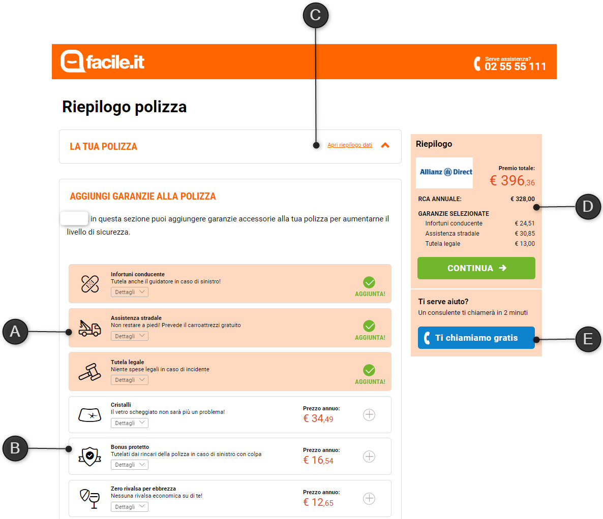

# Upsell page

## Parts of the page

## Description of the parts

| Part | Description |
|--|--|
| A | Selected additional covers. |
| B | Selectable additional covers. |
| C | Accordion with the details of the policy. |
| D | Summary of the costs of the policy and button to proceed to payment. If the payment is managed by the insurance company, the button triggers the redirect to the company's website. Otherwise, if the payment is managed by Facile.it, the button opens the iternal payment page. |
| E | Button to request a support call from the call center. |